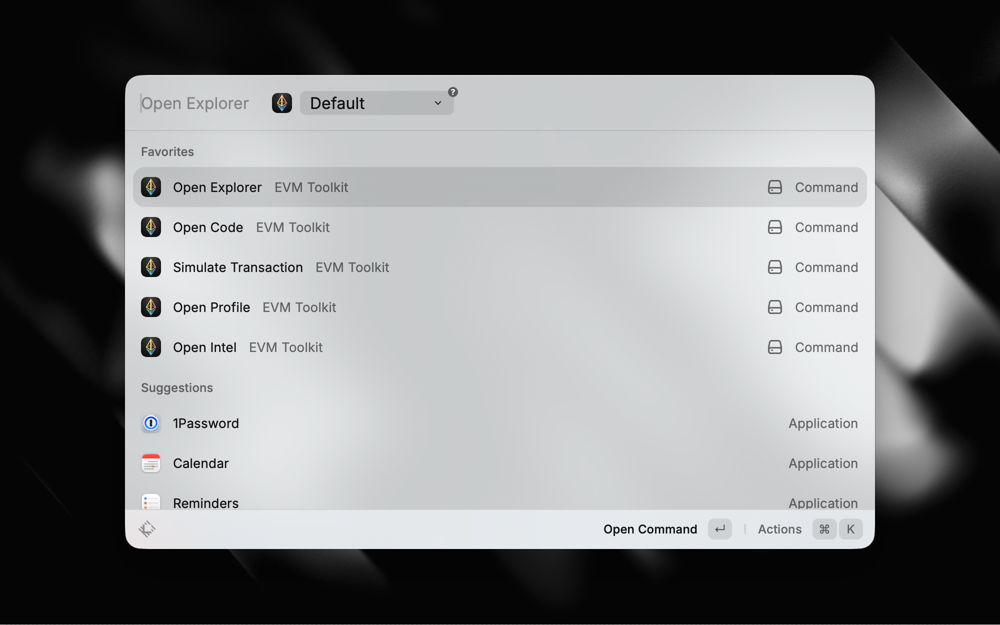

# EVM Toolkit

A [Raycast](https://raycast.com) extension for EVM power users. Copy an address, transaction hash, or block number into your clipboard and instantly open block explorers, read contract source code, check portfolio balances, look up wallet analytics, or simulate transactions across 24+ networks.



## Commands

### Open Explorer

Opens the block explorer page for whatever is in your clipboard.

1. Copy an address, tx hash, or block number
2. Trigger **Open Explorer** in Raycast
3. Optionally pick a network (defaults to your preferred network)
4. Press Enter

The extension detects what you copied based on its format:

| Format                   | Detected as      |
| ------------------------ | ---------------- |
| `0x` + 40 hex characters | Address          |
| `0x` + 64 hex characters | Transaction hash |
| Digits only              | Block number     |

### Open Code

Opens a smart contract's source code in a web IDE via [deth.net](https://etherscan.deth.net/).

1. Copy a contract address
2. Trigger **Open Code** in Raycast
3. Optionally pick a network (defaults to your preferred network)
4. Press Enter

Only addresses are accepted (tx hashes and block numbers are rejected). Available on networks supported by deth.net: Mainnet, Base, Arbitrum, Polygon, Optimism, BSC, Avalanche, Gnosis, Blast, Sonic.

### Open Profile

Opens an account's portfolio page on [DeBank](https://debank.com/).

1. Copy an address
2. Trigger **Open Profile** in Raycast
3. Press Enter

Only addresses are accepted. Network-agnostic: DeBank covers all EVM chains automatically.

### Open Intel

Opens an address's blockchain analytics on [Arkham Intel](https://intel.arkm.com/).

1. Copy an address
2. Trigger **Open Intel** in Raycast
3. Press Enter

Only addresses are accepted. Network-agnostic: Arkham covers all EVM chains automatically.

### Simulate Transaction

Opens a prefilled transaction simulation on [Tenderly](https://dashboard.tenderly.co/simulator/new).

1. Copy an address or calldata to your clipboard (optional, used to prefill fields)
2. Trigger **Simulate Transaction** in Raycast
3. Fill or adjust the form fields:
   - **Target Address** (required): the contract being called
   - **Calldata** (required): hex-encoded function call
   - **Network** (required): defaults to your preferred network
   - **From Address** (optional): caller address
   - **Value in wei** (optional): ETH value sent with the call
4. Press Enter

If your clipboard contains an address it prefills the target; if it contains other hex data it prefills the calldata.

## Supported Networks

Mainnet, Base, Arbitrum, Polygon, Optimism, BSC, Linea, Ink, Arbitrum Nova, zkSync, Avalanche, Gnosis, Scroll, Celo, Mantle, Blast, Sonic, Unichain, Flow, World Chain, ApeChain, Abstract, HyperEVM, Mode.

Each network is mapped to its native block explorer. The extension handles explorer-specific URL patterns (e.g., zkSync uses `/batch/` instead of `/block/` for block pages).

## Preferences

**Default Network**: set your preferred network in the extension settings (Raycast > Extensions > EVM Toolkit). Commands that require a network selection will default to it instead of requiring you to pick one each time. Defaults to Mainnet.

## Development

Prerequisites: Node.js 22+, npm, [Raycast](https://raycast.com).

```sh
npm install
npm run dev        # start in development mode (hot-reload in Raycast)
npm run build      # production build
npm run lint       # run eslint
npm run fix-lint   # auto-fix lint issues
```

## License

MIT
